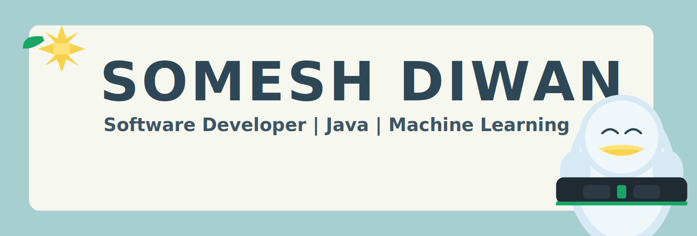

### Languages & Tools 🛠

#### Programming Languages

  <!-- Java -->
  

  <!-- Python -->
  

  <!-- JavaScript -->
  

  <!-- C++ -->
  

<table>
  <tr>
    <td align="center" valign="top">
      <h4>Frontend Development</h4>
      

        
        
        
        
        
        
      

    </td>
    <td align="center" valign="top">
      <h4>Native App Development</h4>
      

        <!-- Swift -->
        
        <!-- Kotlin -->
        
      

    </td>
  </tr>

  <tr>
    <td align="center" valign="top">
  <h4>Backend Development</h4>
  

    <!-- Java -->
    
    <!-- Spring Boot -->
    
    <!-- SQL -->
    
    <!-- PostgreSQL -->
    
  

  

    <!-- MongoDB -->
    
    <!-- Docker -->
    
    <!-- Vercel -->
    
  

</td>
    <td align="center" valign="top">
      <h4>AI tools</h4>
      

        
        
        <!-- LM Studio (reliable icon) -->
        
        <!-- Ollama (reliable icon) -->
        
        <!-- Local LLM (badge fallback) -->
        
      

      <h4>Design tools</h4>
      

        
        
      

    </td>
  </tr>
</table>

  <table align="center" cellpadding="0" cellspacing="0" border="0">
    <tr>
      <td align="center" valign="top" style="padding-right:12px;">
        
      </td>
      <td align="center" valign="top" style="padding-left:12px;">
        
      </td>
    </tr>
  </table>

