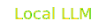

---

<!-- ======================
     Featured Repositories
======================= -->

  <!-- Keep the summary unstyled so GitHub shows the native dropdown triangle -->
  

  <!-- Slimmer banner to match your layout rhythm -->
  
  

  <!-- subtle spacing below the summary -->
  

  <!-- 2×2 grid, centered, comfortable max width -->
  <table align="center" width="100%" style="max-width: 900px;">
    <tr>
      <td valign="top" width="50%" style="padding: 8px 12px;">
        <h4 style="margin:6px 0; font-size:16px; line-height:1.35; font-family:'Comic Sans MS','Segoe UI',Roboto,Arial,sans-serif;">
          <a href="https://github.com/Someshdiwan/JavaEvolution-Learning-Growing-Mastering">
            JavaEvolution – Learning • Growing • Mastering
          </a>
        </h4>
        

          
          
          
          
        

        
A polished, living guide for mastering Java—projects, patterns, clean code, and curated resources.

      </td>
      <td valign="top" width="50%" style="padding: 8px 12px;">
        <h4 style="margin:6px 0; font-size:16px; line-height:1.35; font-family:'Comic Sans MS','Segoe UI',Roboto,Arial,sans-serif;">
          <a href="https://github.com/Someshdiwan/Artificial-Neural-Networks-ANNs">
            Artificial Neural Networks (ANNs)
          </a>
        </h4>
        

          
          
          
          
        

        
Core ANN concepts and implementations: perceptrons, activations, loss, training, and experiments.

      </td>
    </tr>
    <tr>
      <td valign="top" width="50%" style="padding: 8px 12px;">
        <h4 style="margin:6px 0; font-size:16px; line-height:1.35; font-family:'Comic Sans MS','Segoe UI',Roboto,Arial,sans-serif;">
          <a href="https://github.com/Someshdiwan/Convolutional-Neural-Network">
            Convolutional Neural Network
          </a>
        </h4>
        

          
          
          
          
        

        
End-to-end CNN work: conv/pooling blocks, training loops, metrics, and visualization utilities.

      </td>
      <td valign="top" width="50%" style="padding: 8px 12px;">
        <h4 style="margin:6px 0; font-size:16px; line-height:1.35; font-family:'Comic Sans MS','Segoe UI',Roboto,Arial,sans-serif;">
          <a href="https://github.com/Someshdiwan/Emotion-Recognition-System">
            Emotion Recognition System
          </a>
        </h4>
        

          
          
          
          
        

        
Classifies facial emotions with a compact model and clean, reproducible inference pipeline.

      </td>
    </tr>
  </table>
  <!-- 
  

  
  

  -->

---

<!-- Profile Views (left-aligned directly below) -->

  

  <!-- X (Twitter) -->
  
  <!-- LinkedIn -->
  
  <!-- LeetCode -->
  
 <!-- WakaTime -->
  
  <!-- My Medium Article -->
  

 

  <!-- Notion (Vocabulary Vault) -->
  
  <!-- Hugging Face -->
  
  <!-- Anki -->
  
  <!-- Duolingo (HQ official green) -->
  

---

#### Programming Languages

  <!-- Java -->
  
  <!-- Python -->
  
  <!-- JavaScript -->
  
  <!-- C++ -->
  

<table>
  <tr>
    <td align="center" valign="top">
      <h4>Frontend Development</h4>
      

        
        
        
        
        
        
      

    </td>
    <td align="center" valign="top">
      <h4>Native App Development</h4>
      

        <!-- Swift -->
        
        <!-- Kotlin -->
        
      

    </td>
  </tr>
  <tr>
    <td align="center" valign="top">
  <h4>Backend Development</h4>
  

    <!-- Java -->
    
    <!-- Spring Boot -->
    
    <!-- SQL -->
    
    <!-- PostgreSQL -->
    
  

  

    <!-- MongoDB -->
    
    <!-- Docker -->
    
    <!-- Vercel -->
    
  

</td>
    <td align="center" valign="top">
<h4>AI tools</h4>

  
  
  <!-- LM Studio -->
  
  <!-- Ollama -->
  
 <!-- Hugging Face (transparent SVG) -->

  <!-- Local LLM (gold SVG, clickable to your Hugging Face profile) -->
  

<h4>Design tools</h4>
      

        
        
      

    </td>
  </tr>
</table>

  <table align="center" cellpadding="0" cellspacing="0" border="0">
    <tr>
      <td align="center" valign="top" style="padding-right:12px;">
        
      </td>
      <td align="center" valign="top" style="padding-left:12px;">
        
      </td>
    </tr>
  </table>

---

  <!-- Workflow updates the ?v= query parameter to bust GitHub image cache on each run -->
  

---

  <!-- Light mode -->
  <picture>
    <source media="(prefers-color-scheme: dark)"
            srcset="https://raw.githubusercontent.com/Someshdiwan/Someshdiwan/output/github-contribution-grid-snake-dark.svg">
    
  </picture>

---
