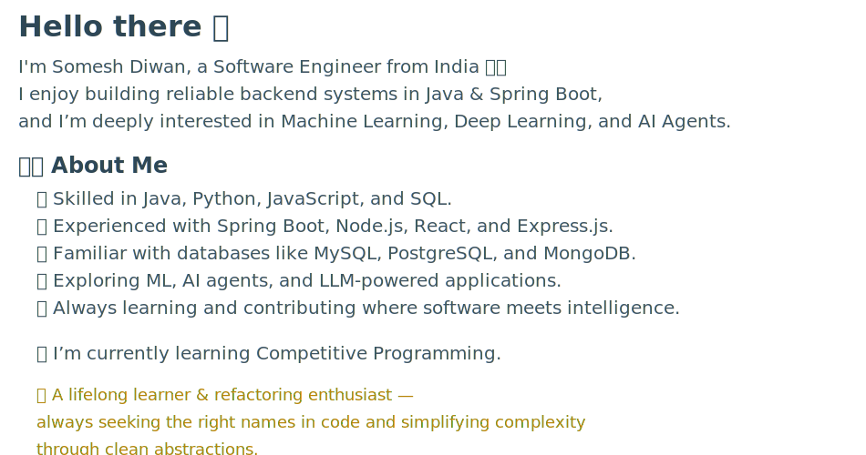
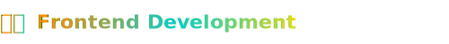
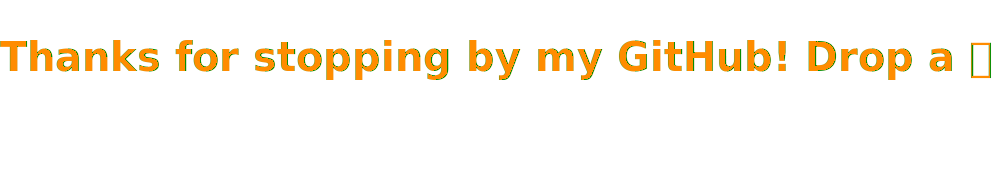

---

  

    <picture>
      <source media="(prefers-color-scheme: dark)" srcset="Assets/featured-button-glass-dark.svg">
      <source media="(prefers-color-scheme: light)" srcset="Assets/featured-button-glass-light.svg">
      
    </picture>
  

  

  <table align="center" width="100%" style="max-width:980px;">
<tr> 
<td valign="top" width="50%" style="padding:16px 18px;">

          

<ul style="list-style:none;padding-left:0;margin:14px 0;">

<li style="margin:18px 0;">
            <h4 style="margin:4px 0;font-size:16px;font-family:'Comic Sans MS','Segoe UI',Roboto,Arial,sans-serif;">
              <a href="https://github.com/Someshdiwan/JavaEvolution-Learning-Growing-Mastering">JavaEvolution – Learning • Growing • Mastering ↗</a>
            </h4>
            

              
              
            
 

Learn More

    • Core & OOP: methods, recursion, classes/objects, inheritance, abstract classes, interfaces, inner classes, static/final, packages, <code>java.lang</code>, annotations & Javadoc 
    • Java 8 Crash Course: lambdas & functional interfaces, streams (intermediate/terminal, primitive, parallel, pipelines), Optional, CompletableFuture, collectors, I/O & StringTokenizer 
    • Collections Deep Dive: List/ArrayList, LinkedList, Vector/Stack; Map family (HashMap internals, LinkedHashMap & LRU, TreeMap/Red-Black, Identity/Weak/ConcurrentHashMap); Set & Sorted/ Navigable; Queue/Deque, Blocking queues, priority queues — with internals, images & notes 
    • Concurrency & Threading: threads, synchronization, locks (reentrant/RW), deadlocks, thread pools & Executors, CountDownLatch/CyclicBarrier, CompletableFuture use-cases, virtual threads (Loom) visuals 
    • Generics: generic classes/methods, wildcards, bounds, interfaces, exception caveats 
    • Exceptions & Resources: checked vs unchecked, custom exceptions, try-with-resources patterns 
    • Date/Time API: core classes, formatting, zones, practical snippets 
    • Networking & JDBC (SQLite): UDP echo servers/clients, multiclient reverse-echo; JDBC drivers, DDL/DML, prepared/callable statements; schema & SQL notes 
    • Versions Atlas: focused notes & examples for Java 8, 11, 12, 14, 17, 21, 24 (feature PDFs & demos) 
    • Tooling & Site: GitHub Pages (Jekyll) + Actions, Telegram notify workflows, CONTRIBUTING, LICENSE/NOTICE

</li>
          <!-- ✅ Project 2: Todo List App -->
          <li style="margin:18px 0;">
            <h4 style="margin:4px 0;font-size:16px;font-family:'Comic Sans MS','Segoe UI',Roboto,Arial,sans-serif;">
              <a href="https://github.com/Someshdiwan/Todo-List-Application">Todo-List Application ↗</a>
            </h4>
            

              
              
            

            

              
Learn More

  • A cleanly architected Todo Management Platform that helps users capture tasks, track progress, and stay organized in everyday workflows 
  • Designed using Java + Spring Boot with a neat separation of responsibilities across <code>controller</code> and <code>service</code> layers — simple to maintain, flexible to extend 
  • Smart payload handling through DTOs (<code>CreateTodoRequest</code> / <code>UpdateTodoRequest</code>) to ensure reliable data flow and safe state changes 
  • Unified, developer-friendly error responses with <code>GlobalExceptionHandler</code> — improving API predictability and debugging clarity 
  • Self-contained UI included (<code>static/index.html</code>) allowing instant interaction with features without external tooling 
  • Thoughtful engineering notes inside the System Design folder — LLD diagrams, principles, and decisions documented for real-world reasoning 
  • Docker-packaged for effortless deployment across environments, showcasing readiness for cloud and container ecosystems 
  • Well-structured project hygiene: <code>pom.xml</code>, LICENSE, clear README — engineered for collaboration and future enhancements

</li>

<li style="margin:18px 0;opacity:0.7;">
  Expanding this section with new ML projects & open-source contributions — stay tuned! ✨
</li>

</ul>
</td>
      <td valign="top" width="50%" style="padding:16px 18px;border-left:1px solid #eee;">
        

          
        

        <ul style="list-style:none;padding-left:0;margin:14px 0;">

<li style="margin:18px 0;">
  <h4 style="margin:4px 0;font-size:16px;font-family:'Comic Sans MS','Segoe UI';">
    <a href="https://github.com/Someshdiwan/Artificial-Neural-Networks-ANNs">Artificial Neural Networks (ANNs) ↗</a>
  </h4>
  

    
    
  

  

    

      Perceptrons • Logic Gates • Backpropagation ↗
    

    

      • Hands-on learning project demonstrating the fundamentals of Artificial Neural Networks 
      • Builds perceptron models from scratch to classify AND, OR, and NOT gates (no frameworks — pure math) 
      • Implements Multilayer Perceptron (MLP) with backpropagation to solve the nonlinear XOR problem 
      • Visuals included (<code>and_gate.png</code>) to show convergence and decision boundaries 
      • Python scripts show feedforward, weight updates, activation functions & loss behavior step-by-step 
      • Great foundational reference for interviews, ML courses, or transitioning into deep learning frameworks
    

  

</li>

<li style="margin:18px 0;">
  <h4 style="margin:4px 0;font-size:16px;font-family:'Comic Sans MS','Segoe UI';">
    <a href="https://github.com/Someshdiwan/Convolutional-Neural-Network">Convolutional Neural Network ↗</a>
  </h4>
  

    
    
  

  

    

      CNNs • Transfer Learning • Autoencoders ↗
    

    

      • End-to-end image classifiers with TensorFlow/Keras (clean training/validation workflow) 
      • Transfer learning & fine-tuning notebook for rapid convergence on small datasets 
      • Autoencoder implementation for representation learning & reconstruction demos 
      • Supporting notebooks: basic perceptron, regression, vector ops, and a simple LSTM for sequence intuition 
      • Reproducible runs (seeds), core metrics (accuracy/loss), quick visualization hooks 
      • Organized as Jupyter notebooks: <code>Image Classifier.ipynb</code>, <code>Implementation of image classifier using CNN.ipynb</code>, <code>Implement Transfer Learning with Fine Tuning.ipynb</code>, <code>Implementation of Autoencoder.ipynb</code>, etc.
    

  

</li>

<li style="margin:18px 0;">
  <h4 style="margin:4px 0;font-size:16px;font-family:'Comic Sans MS','Segoe UI';">
    <a href="https://github.com/Someshdiwan/Emotion-Recognition-System">Emotion Recognition System ↗</a>
  </h4>
  

    
    
  

  

    

      Speech Emotion AI • MFCCs • Spectrograms ↗
    

    

      • Deep learning pipeline that classifies human emotions from speech signals (anger, happy, sad, fear, etc.) 
      • Extracts powerful audio features using MFCCs and Spectrograms for emotion-specific acoustic patterns 
      • Includes training notebooks (<code>Emotion Recognition.ipynb</code>) + inference-ready prediction workflow 
      • Data augmentation folder to improve generalization and reduce overfitting on small speech datasets 
      • Evaluation assets like confusion matrices and test predictions for model performance insights 
      • Strong use-case for human–computer interaction, call-center analytics, mental health monitoring & more
    

  

</li>

<li style="margin:18px 0;">
  <h4 style="margin:4px 0;font-size:16px;font-family:'Comic Sans MS','Segoe UI';">
    <a href="https://github.com/Someshdiwan/HFTutorial">Text Summarization with HuggingFace Transformers ↗</a>
  </h4>
  

    
    
  

  

    

      HuggingFace • BART • Abstractive Summaries ↗
    

    

      • Demonstrates real-world NLP by summarizing long text using Hugging Face Transformers 
      • Uses the <code>facebook/bart-large-cnn</code> model — a powerful encoder–decoder architecture for abstractive summarization 
      • Simple Python inference script (<code>Main.py</code>) → tokenize → generate → decode → clean output 
      • Includes discussion notes (<code>HFT.txt</code>) explaining how transformer-based models understand language context 
      • Easily extendable into Streamlit/Flask API or dataset-based evaluation workflows 
      • Dependency-managed through <code>Requirements.txt</code> — ready for GPU/Colab deployment
    

  

</li>
</ul>

</td>
    </tr>
  </table>

---

---

  

    
  

  <!-- Responsive SVG Container with Embedded Styles -->
  <svg viewBox="0 0 920 400" xmlns="http://www.w3.org/2000/svg" style="max-width:100%; height:auto; display:block; margin:18px auto;">
    <foreignObject x="0" y="0" width="920" height="400">
      

        <!-- Profile views -->
        

          
        

        <!-- Links grid -->
        

          <!-- LEFT COLUMN -->
          

            
            
            
          

          <!-- MIDDLE COLUMN -->
          

            
            
            
          

          <!-- RIGHT COLUMN -->
          

            
            
            
          

        

      

      <!-- Embedded Responsive Styles (GitHub allows this inside SVG) -->
      
    </foreignObject>
  </svg>
  <!-- Accessibility wrapper (non-rendered) -->
  

---

---

---

  

    
  

  

    

      
    

    

      <!-- LEFT COLUMN -->
      

       
        
        
      

      <!-- MIDDLE COLUMN (new) -->
      

<!-- Anki — Vocabulary Vault (search results) -->
<a class="link-card"
   href="https://ankiweb.net/shared/decks?search=Vocabulary%20Vault%20%E2%80%94%20Rich%20English%20vocab%20flashcards"
   target="_blank"
   rel="noopener noreferrer"
   title="Anki — Vocabulary Vault (Search results)"
   aria-label="Open Anki Vocabulary Vault search results">
  
  <!-- optional label shown under the icon -->
  <!-- 
Anki — Vocabulary Vault
 -->
</a>
       
        
      

      <!-- RIGHT COLUMN -->
      

        
        
        
      

    

  

---

<!-- Everything below stays inside this div until tech stacks end -->

<!-- Programming Languages Section -->

<!-- Java Icon (Static in GitHub README — but perfect compatibility) -->

<!-- Python -->

<!-- JavaScript -->

<!-- C++ -->

<!-- Tech Stack Table -->

<table cellspacing="0" cellpadding="30" border="0" style="border-collapse: separate; border-spacing: 40px 20px;">
  <tr>
    <td align="center" valign="top" width="45%">
      <!-- Frontend Development -->
      
        
      

        
      

      

        
        
        
      

    </td>
    <td align="center" valign="top" width="45%">
<!-- Native App Development -->
      
        
      
 
<!-- Swift -->

<!-- Xcode -->

<!-- Create ML -->

</td>
  </tr>
  <tr>
    <td align="center" valign="top" width="45%">
      <!-- Backend Development -->
      
        
      

        
        

<!-- Design Tools -->

        
      

        
        
      

    </td>
    <td align="center" valign="top" width="45%">
      <!-- AI Tools -->
      
        
      

        
        
      

      

        
        
      

      

      

      
      

    

       
    </td>
  </tr>
</table>

 

---

  <!-- Workflow updates the ?v= query parameter to bust GitHub image cache on each run -->
  

---

  <!-- Light mode -->
  <picture>
    <source media="(prefers-color-scheme: dark)"
            srcset="https://raw.githubusercontent.com/Someshdiwan/Someshdiwan/output/github-contribution-grid-snake-dark.svg">
    
  </picture>

---

<!-- GitHub Streak Stats (no table, no border) -->

  

---

 
<!-- Thank You -->

  

 

---