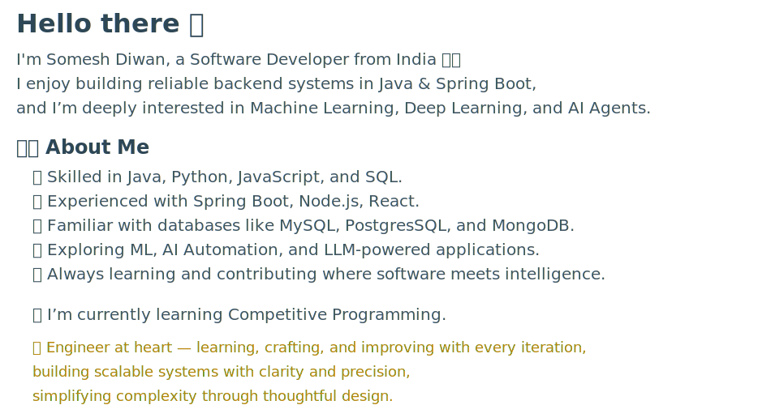

[//]: # ()
[//]: # ()
[//]: # ()

------------------------------------------------------------------------------------------------------------------------

  

    <picture>
      <source media="(prefers-color-scheme: dark)" srcset="Assets/featured-button-glass-dark.svg">
      <source media="(prefers-color-scheme: light)" srcset="Assets/featured-button-glass-light.svg">
      
    </picture>
  

  

  <table align="center" width="100%" style="max-width:980px;">
    <tr>
      <!-- Left Column: Backend & Engineering -->
      <td valign="top" width="50%" style="padding:16px 18px;">
        

          
        

        <ul style="list-style:none;padding-left:0;margin:14px 0;">
          <!-- FEATURED PROJECTS SECTION -->
          <li style="list-style:none;">
            

              

                

                  
                

              

              

              

                <ul style="list-style:none;padding-left:0;margin:14px 0;">
                  <!-- Project 1: Java SE -->
                  <li style="margin:18px 0;">
                    <h4 style="margin:4px 0;font-size:16px;font-family:'Comic Sans MS','Segoe UI',Roboto,Arial,sans-serif;">
                      <a href="https://github.com/Someshdiwan/JavaEvolution-Learning-Growing-Mastering">JavaEvolution – Learning • Growing • Mastering ↗</a>
                    </h4>
                    

                      
                      
                    

                    

                      
Learn More

                      

                        • Core & OOP: methods, recursion, classes/objects, inheritance, abstract classes, interfaces, inner classes, static/final, packages, <code>java.lang</code>, annotations & Javadoc 
                        • Java 8 Crash Course: lambdas & functional interfaces, streams (intermediate/terminal, primitive, parallel, pipelines), Optional, CompletableFuture, collectors, I/O & StringTokenizer 
                        • Collections Deep Dive: List/ArrayList, LinkedList, Vector/Stack; Map family (HashMap internals, LinkedHashMap & LRU, TreeMap/Red-Black, Identity/Weak/ConcurrentHashMap); Set & Sorted/ Navigable; Queue/Deque, Blocking queues, priority queues — with internals, images & notes 
                        • Concurrency & Threading: threads, synchronization, locks (reentrant/RW), deadlocks, thread pools & Executors, CountDownLatch/CyclicBarrier, CompletableFuture use-cases, virtual threads (Loom) visuals 
                        • Generics: generic classes/methods, wildcards, bounds, interfaces, exception caveats 
                        • Exceptions & Resources: checked vs unchecked, custom exceptions, try-with-resources patterns 
                        • Date/Time API: core classes, formatting, zones, practical snippets 
                        • Networking & JDBC (SQLite): UDP echo servers/clients, multiclient reverse-echo; JDBC drivers, DDL/DML, prepared/callable statements; schema & SQL notes 
                        • Versions Atlas: focused notes & examples for Java 8, 11, 12, 14, 17, 21, 24 (feature PDFs & demos) 
                        • Tooling & Site: GitHub Pages (Jekyll) + Actions, Telegram notify workflows, CONTRIBUTING, LICENSE/NOTICE
                      

                    

                  </li>
                  <!-- Project 2: Todo List App -->
                  <li style="margin:18px 0;">
                    <h4 style="margin:4px 0;font-size:16px;font-family:'Comic Sans MS','Segoe UI',Roboto,Arial,sans-serif;">
                      <a href="https://github.com/Someshdiwan/Todo-List-Application">Todo-List Application ↗</a>
                    </h4>
                    

                      
                      
                    

                    

                      
Learn More

                      

                        • A cleanly architected Todo Management Platform that helps users capture tasks, track progress, and stay organized in everyday workflows 
                        • Designed using Java + Spring Boot with a neat separation of responsibilities across <code>controller</code> and <code>service</code> layers — simple to maintain, flexible to extend 
                        • Smart payload handling through DTOs (<code>CreateTodoRequest</code> / <code>UpdateTodoRequest</code>) to ensure reliable data flow and safe state changes 
                        • Unified, developer-friendly error responses with <code>GlobalExceptionHandler</code> — improving API predictability and debugging clarity 
                        • Self-contained UI included (<code>static/index.html</code>) allowing instant interaction with features without external tooling 
                        • Thoughtful engineering notes inside the System Design folder — LLD diagrams, principles, and decisions documented for real-world reasoning 
                        • Docker-packaged for effortless deployment across environments, showcasing readiness for cloud and container ecosystems 
                        • Well-structured project hygiene: <code>pom.xml</code>, LICENSE, clear README — engineered for collaboration and future enhancements
                      

                    

                  </li>
                  <!-- Project 3: Abstract Window Toolkit (AWT) -->
                  <li style="margin:18px 0;">
                    <h4 style="margin:4px 0;font-size:16px;font-family:'Comic Sans MS','Segoe UI',Roboto,Arial,sans-serif;">
                      <a href="https://github.com/Someshdiwan/Abstract-Window-Toolkit">Abstract Window Toolkit (AWT) ↗</a>
                    </h4>
                    

                      
                      
                    

                    

                      
Learn More

                      

                        • Comprehensive collection of Java AWT programs demonstrating GUI design fundamentals and event handling 
                        • Covers multiple modules: <strong>Adapter Classes</strong>, <strong>Event Delegation Model</strong>, <strong>Frame-Based Applications</strong>, <strong>Layout Managers</strong>, <strong>Painting & Color</strong>, and more 
                        • Implements practical demos — <code>ButtonDemo</code>, <code>CheckBoxDemo</code>, <code>TextFieldDemo</code>, <code>ScrollbarDemo</code>, <code>KeyEventDemo</code>, <code>MouseEventDemo</code>, and <code>WindowEventDemo</code> 
                        • Visual assets (PNG diagrams and comparisons) explain AWT layouts like FlowLayout, BorderLayout, GridLayout, and CardLayout 
                        • Demonstrates all four approaches to event handling: Frame as Listener, Inner Class, Anonymous Class, and Lambda Expression 
                        • Animation folder includes gravity, shape-fall, and space simulations written using AWT drawing and threading 
                        • Includes <code>LICENSE</code> and structured source folders for modular understanding and easy navigation 
                      

                    

                  </li>
                  <!-- Project 4: ASCII–Binary Character Table -->
                  <li style="margin:18px 0;">
                    <h4 style="margin:4px 0;font-size:16px;font-family:'Comic Sans MS','Segoe UI',Roboto,Arial,sans-serif;">
                      <a href="https://github.com/Someshdiwan/ASCII-Binary-Character-Table">ASCII–Binary Character Table ↗</a>
                    </h4>
                    

                      
                      
                    

                    

                      
Learn More

                      

                        • Interactive reference project showcasing ASCII and Unicode character mappings 
                        • Includes downloadable <code>ASCII - Binary Character Table.pdf</code> for quick offline lookup 
                        • Explains differences between <strong>ASCII</strong> (128-character encoding) and <strong>Unicode</strong> (143K+ characters covering all scripts) 
                        • Web-based interface (<code>index.html</code>) displaying characters, binary codes, and descriptions with light/dark theme toggles 
                        • Assets (<code>sun.png</code>, <code>moon.png</code>, favicons) and <code>vercel.json</code> for seamless Vercel deployment 
                        • Perfect resource for developers learning text encoding, binary representation, and web deployment fundamentals 
                        • Contains <code>README.md</code> and <code>LICENSE</code> — open-source and educationally focused 
                      

                    

                  </li>
                  <!-- Project 5: Docker Guide -->
                  <li style="margin:18px 0;">
                    <h4 style="margin:4px 0;font-size:16px;font-family:'Comic Sans MS','Segoe UI',Roboto,Arial,sans-serif;">
                      <a href="https://github.com/Someshdiwan/Docker-Guide">Docker Guide ↗</a>
                    </h4>
                    

                      
                      
                    

                    

                      
Learn More

                      

                        • Visually rich guide covering essential Docker commands for development and maintenance 
                        • Organized tabs for Operations, Monitoring, Cleanup, and Best Practices 
                        • Demonstrates core actions like building, running, and cleaning containers with concise command blocks 
                        • Clean dark-themed interface designed for quick reference and hands-on learning 
                      

                    

                  </li>
                  <!-- Project 6: Java Swing -->
                  <li style="margin:18px 0;">
                    <h4 style="margin:4px 0;font-size:16px;font-family:'Comic Sans MS','Segoe UI';">
                      <a href="https://github.com/Someshdiwan/Java-Swing">Java Swing ↗</a>
                    </h4>
                    

                      
                      
                    

                    

                      
Learn More

                      

                        • Comprehensive repository demonstrating <strong>Java Swing</strong> concepts — the foundation of Java-based desktop GUI programming 
                        • Organized into interactive modules covering all major Swing components: <code>JButton</code>, <code>JTextField</code>, <code>JList</code>, <code>JComboBox</code>, <code>JTree</code>, <code>JSlider</code>, <code>JProgressBar</code>, and more 
                        • Includes real-world UI examples: <strong>Menus & Toolbars</strong>, <strong>Tabbed & Split Panes</strong>, <strong>Internal Frames</strong>, and <strong>Layered Panes</strong> 
                        • Each folder demonstrates distinct topics — borders, sliders, spinners, look & feel, trees, layout management, and event-driven behavior 
                        • Provides comparative visual resources (<code>AWT vs Swing.png</code>, <code>Look and Feel Swing.png</code>) to explain design and framework evolution 
                        • Implements advanced GUI structures such as <strong>JInternalFrame</strong> and <strong>JLayeredPane</strong> to manage complex window hierarchies 
                        • Tree component modules illustrate hierarchical models with logical variations and textual documentation 
                        • Menu and toolbar module integrates icons, shortcuts, and color actions — mirroring real application interfaces 
                        • Comprehensive and modular — excellent for learners exploring event handling, component customization, and layout optimization in Swing 
                        • Includes <code>LICENSE</code> and visual assets to ensure complete reproducibility and educational reference 
                      

                    

                  </li>
                  <!-- Project 7: Java FX -->
                  <li style="margin:18px 0;">
                    <h4 style="margin:4px 0;font-size:16px;font-family:'Comic Sans MS','Segoe UI';">
                      <a href="https://github.com/Someshdiwan/JavaFX">JavaFX ↗</a>
                    </h4>
                    

                      
                      
                    

                    

                      
Learn More ↗

                      

                        • A comprehensive learning repository on <strong>JavaFX</strong>, illustrating the fundamentals and advanced constructs of modern Java GUI programming 
                        • Begins with <code>StructureOfFXApplication</code> — detailing the core architecture of a JavaFX app including <strong>Application</strong>, <strong>Stage</strong>, and <strong>Scene</strong> lifecycle 
                        • <strong>CommonPropertiesofControls</strong> explores shared control attributes like text alignment, color, font styles, and event listeners 
                        • <strong>Controls & Input Elements:</strong> practical implementations of CheckBox, RadioButton, ComboBox, DatePicker, ColorPicker, FileChooser, and TextArea — each paired with annotated diagrams and screenshots 
                        • <strong>EventHandling</strong> demonstrates multiple approaches — from simple event methods to custom event classes and handler interfaces — visualized with <code>Event Handling.png</code> for clarity 
                        • <strong>Layouts & Panes:</strong> rich demonstrations of layout managers such as BorderPane, GridPane, FlowPane, VBox, HBox, StackPane, TilePane, Accordion, TabPane, ScrollPane, and SplitPane 
                        • Each layout example visually shows how nodes, panes, and containers interact to form hierarchical scene graphs, with supportive logic notes and layout diagrams 
                        • <strong>Interactive Examples:</strong> modules like <code>ComboBoxFormApplication</code> and <code>BugFixComboBoxApp</code> integrate logic with form design, dynamic item selection, and user input validation 
                        • Includes explanatory text files and logic images (<code>Logic.png</code>, <code>Layouts.png</code>, etc.) that connect code behavior to underlying UI architecture 
                        • Designed as a visual–code hybrid reference for mastering scene graph design, component properties, and JavaFX event-driven programming 
                        • Licensed and modular — a complete educational package for students, developers, and educators seeking a structured deep dive into the JavaFX ecosystem 
                      

                    

                  </li>
                </ul>
              

            

          </li>
          <!-- MINI PROJECTS SECTION -->
          <li style="list-style:none;">
            

              

                

                  
                

              

              

              

                <ul style="list-style:none;padding-left:0;margin:14px 0;">
                  <!-- Mini Project: File Encryption Tool -->
                  <li style="margin:18px 0;" align="center">
                    <h4 style="margin:4px 0;font-size:16px;font-family:'Comic Sans MS','Segoe UI';">
                      <a href="https://github.com/Someshdiwan/File-Encryption-Tool">File Encryption Tool ↗</a>
                    </h4>
                    

                      
AES Encryption • Decryption • Key Management ↗

                      

                        • A compact <strong>Java AES File Encryption Tool</strong> showcasing real-world use of the <strong>Java Cryptography Architecture (JCA)</strong> 
                        • Supports <strong>key generation</strong>, <strong>file encryption</strong>, and <strong>decryption</strong> via a simple CLI 
                        • Implements secure <code>256-bit AES</code> with modular methods and safe stream handling 
                        • Lightweight design — fast, functional, and perfect for learning practical cryptography 
                      

                    

                  </li>
                  <!-- Mini Project: Inventory Management System -->
                  <li style="margin:18px 0;" align="center">
                    <h4 style="margin:4px 0;font-size:16px;font-family:'Comic Sans MS','Segoe UI';">
                      <a href="https://github.com/Someshdiwan/InventoryManagement">Inventory Management System ↗</a>
                    </h4>
                    

                      
Flow • Features • File Layout ↗

                      

                        • Practical Java CRUD implementation showing how real software actually stores, updates and persists business data 
                        • Demonstrates basic inventory operations: insert, update, delete, search, list — the foundation of 80% real business systems 
                        • Teaches separation of storage vs user interaction before databases are introduced (CSV file used as lightweight persistence) 
                        • Reinforces why arrays / lists are not “toy” — they are the primitive basis behind tables, DB rows, and record stores 
                      

                    

                  </li>
                  <!-- Mini Project: Word Counter -->
                  <li style="margin:18px 0;" align="center">
                    <h4 style="margin:4px 0;font-size:16px;font-family:'Comic Sans MS','Segoe UI';">
                      <a href="https://github.com/Someshdiwan/Word-Counter">Word Counter ↗</a>
                    </h4>
                    

                      
Flow • Features • Why This Project ↗

                      

                        • Practical text-processing demo showing how raw text is converted into meaningful measurable data 
                        • Demonstrates two approaches — <code>split()</code> tokenization vs <code>regex</code> tokenization — and how token strategy changes counts 
                        • Teaches how to compute total token count + target word frequency which is the baseline of real search, keyword analytics and NLP 
                        • Reinforces file handling (read external file), parsing, normalization and frequency mapping — core foundation before NLP libraries 
                      

                    

                  </li>
                  <!-- Mini Project: Contact Manager -->
                  <li style="margin:18px 0;" align="center">
                    <h4 style="margin:4px 0;font-size:16px;font-family:'Comic Sans MS','Segoe UI';">
                      <a href="https://github.com/Someshdiwan/Contact-Manager">Contact Manager ↗</a>
                    </h4>
                    

                      
Flow • Features • Why This Project ↗

                      

                        • Practical contacts CRUD system showing how interactive applications store and mutate user-provided data 
                        • Demonstrates add, view, search, update and delete operations — same fundamental pattern used in phonebooks / CRM apps 
                        • Reinforces validation logic (regex based phone checks) and name lookups using ArrayList index management 
                        • Builds the mental model for mapping user choices → controlled state manipulation before database era 
                      

                    

                  </li>
                  <!-- Mini Project: Quiz Game -->
                  <li style="margin:18px 0;" align="center">
                    <h4 style="margin:4px 0;font-size:16px;font-family:'Comic Sans MS','Segoe UI';">
                      <a href="https://github.com/Someshdiwan/Quiz-Game">Quiz Game ↗</a>
                    </h4>
                    

                      
Flow • Features • Why This Project ↗

                      

                        • Demonstrates how interactive MCQ engines work: show question → show four options → read answer → evaluate 
                        • Reinforces conditional validation + scoring logic — immediate feedback loops used in quiz apps / exam portals 
                        • Introduces timed thinking — 10–second countdown concept forms basis of “timed round” game mechanics 
                        • Builds understanding of question → response → score update cycles before GUI / DB / networking layers are added 
                      

                    

                  </li>
                </ul>
              

            

          </li>
        </ul>
      </td>
      <!-- Right Column: AI & Machine Learning -->
      <td valign="top" width="50%" style="padding:16px 18px;border-left:1px solid #eee;">
        

          
        

        <ul style="list-style:none;padding-left:0;margin:14px 0;">
          <!-- Digital Image Processing -->
          <li style="margin:18px 0;">
            <h4 style="margin:4px 0;font-size:16px;font-family:'Comic Sans MS','Segoe UI';">
              <a href="https://github.com/Someshdiwan/Digital-Image-Processing">Digital Image Processing ↗</a>
            </h4>
            

              
              
            

            

              
Filtering • Morphology • Edge Detection • Visualization ↗

              

                • A comprehensive practical collection of <strong>Digital Image Processing (DIP)</strong> algorithms implemented in Python 
                • Explores essential concepts such as <strong>smoothing, sharpening, frequency filtering, and edge enhancement</strong> 
                • <code>Low&HighPassFilter.py</code> demonstrates Fourier-based low-pass and high-pass transformations with clear visual results 
                • <code>MorphologicalOperations.py</code> applies erosion, dilation, opening, and closing to extract or refine object structures 
                • <code>BoundariesExtractionImage.py</code> isolates object contours and highlights region boundaries from grayscale inputs 
                • <code>Smoothing&SharpeningImage.py</code> shows the impact of kernel operations and gradient-based sharpening filters 
                • Each module is supported with paired <strong>input/output image sets</strong> for intuitive understanding of visual transformations 
                • <code>DIP Overview</code> directory includes annotated images and videos explaining the effect of each transformation 
                • Features a <strong>live static site</strong> hosted on GitHub Pages — <a href="https://someshdiwan.github.io/Digital-Image-Processing/" target="_blank" rel="noopener noreferrer">Explore Online ↗</a> — for interactive preview of results 
                • Cleanly structured repository with <code>README.md</code>, modular Python scripts, and educational visuals for students and practitioners 
              

            

          </li>
          <!-- Artificial Neural Networks (ANNs) -->
          <li style="margin:18px 0;">
            <h4 style="margin:4px 0;font-size:16px;font-family:'Comic Sans MS','Segoe UI';">
              <a href="https://github.com/Someshdiwan/Artificial-Neural-Networks-ANNs">Artificial Neural Networks (ANNs) ↗</a>
            </h4>
            

              
              
            

            

              
Perceptrons • Logic Gates • Backpropagation ↗

              

                • Hands-on learning project demonstrating the fundamentals of Artificial Neural Networks 
                • Builds perceptron models from scratch to classify AND, OR, and NOT gates (no frameworks — pure math) 
                • Implements Multilayer Perceptron (MLP) with backpropagation to solve the nonlinear XOR problem 
                • Visuals included (<code>and_gate.png</code>) to show convergence and decision boundaries 
                • Python scripts show feedforward, weight updates, activation functions & loss behavior step-by-step 
                • Great foundational reference for interviews, ML courses, or transitioning into deep learning frameworks
              

            

          </li>
          <!-- Convolutional Neural Network -->
          <li style="margin:18px 0;">
            <h4 style="margin:4px 0;font-size:16px;font-family:'Comic Sans MS','Segoe UI';">
              <a href="https://github.com/Someshdiwan/Convolutional-Neural-Network">Convolutional Neural Network ↗</a>
            </h4>
            

              
              
            

            

              
CNNs • Transfer Learning • Autoencoders ↗

              

                • End-to-end image classifiers with TensorFlow/Keras (clean training/validation workflow) 
                • Transfer learning & fine-tuning notebook for rapid convergence on small datasets 
                • Autoencoder implementation for representation learning & reconstruction demos 
                • Supporting notebooks: basic perceptron, regression, vector ops, and a simple LSTM for sequence intuition 
                • Reproducible runs (seeds), core metrics (accuracy/loss), quick visualization hooks 
                • Organized as Jupyter notebooks: <code>Image Classifier.ipynb</code>, <code>Implementation of image classifier using CNN.ipynb</code>, <code>Implement Transfer Learning with Fine Tuning.ipynb</code>, <code>Implementation of Autoencoder.ipynb</code>, etc.
              

            

          </li>
          <!-- Generative Adversarial Network (GAN) -->
          <li style="margin:18px 0;">
            <h4 style="margin:4px 0;font-size:16px;font-family:'Comic Sans MS','Segoe UI';">
              <a href="https://github.com/Someshdiwan/Generative-Adversarial-Network">Generative Adversarial Network (GAN) ↗</a>
            </h4>
            

              
              
            

            

              
GANs • DCGAN • Pix2Pix • CycleGAN ↗

              

                • Comprehensive collection of <strong>Generative Adversarial Network (GAN)</strong> architectures exploring image generation and translation tasks 
                • Begins with <code>Basic_GAN.ipynb</code> — an introduction to adversarial learning between generator and discriminator models 
                • Includes <strong>Deep Convolutional GAN (DCGAN)</strong> for high-quality image synthesis using convolutional feature hierarchies 
                • <code>Conditional_GAN.ipynb</code> and <code>Conditional GAN.txt</code> demonstrate label-conditioned image generation for multi-class control 
                • Implements <strong>Pix2Pix</strong> for paired image-to-image translation and <strong>CycleGAN</strong> for unpaired domain mapping (e.g., photo ↔ sketch) 
                • Covers <strong>Progressive Growing of GANs</strong> — generating high-resolution outputs through staged network expansion 
                • Organized with explanatory text files and Jupyter notebooks for conceptual and visual understanding 
                • Each subproject focuses on practical intuition — training workflow, loss dynamics, and visual output progression 
                • Well-suited for learners exploring generative modeling, adversarial optimization, and modern deep learning architectures 
              

            

          </li>
          <!-- Emotion Recognition System -->
          <li style="margin:18px 0;">
            <h4 style="margin:4px 0;font-size:16px;font-family:'Comic Sans MS','Segoe UI';">
              <a href="https://github.com/Someshdiwan/Emotion-Recognition-System">Emotion Recognition System ↗</a>
            </h4>
            

              
              
            

            

              
Speech Emotion AI • MFCCs • Spectrograms ↗

              

                • Deep learning pipeline that classifies human emotions from speech signals (anger, happy, sad, fear, etc.) 
                • Extracts powerful audio features using MFCCs and Spectrograms for emotion-specific acoustic patterns 
                • Includes training notebooks (<code>Emotion Recognition.ipynb</code>) + inference-ready prediction workflow 
                • Data augmentation folder to improve generalization and reduce overfitting on small speech datasets 
                • Evaluation assets like confusion matrices and test predictions for model performance insights 
                • Strong use-case for human–computer interaction, call-center analytics, mental health monitoring & more
              

            

          </li>
          <!-- Text Summarization with HuggingFace Transformers -->
          <li style="margin:18px 0;">
            <h4 style="margin:4px 0;font-size:16px;font-family:'Comic Sans MS','Segoe UI';">
              <a href="https://github.com/Someshdiwan/HFTutorial">Text Summarization with HuggingFace Transformers ↗</a>
            </h4>
            

              
              
            

            

              
HuggingFace • BART • Abstractive Summaries ↗

              

                • Demonstrates real-world NLP by summarizing long text using Hugging Face Transformers 
                • Uses the <code>facebook/bart-large-cnn</code> model — a powerful encoder–decoder architecture for abstractive summarization 
                • Simple Python inference script (<code>Main.py</code>) → tokenize → generate → decode → clean output 
                • Includes discussion notes (<code>HFT.txt</code>) explaining how transformer-based models understand language context 
                • Easily extendable into Streamlit/Flask API or dataset-based evaluation workflows 
                • Dependency-managed through <code>Requirements.txt</code> — ready for GPU/Colab deployment
              

            

          </li>
          <!-- Computer Vision and Pattern Recognition -->
          <li style="margin:18px 0;">
            <h4 style="margin:4px 0;font-size:16px;font-family:'Comic Sans MS','Segoe UI';">
              <a href="https://github.com/Someshdiwan/Computer-Vision-and-Pattern-Recognition">Computer Vision and Pattern Recognition ↗</a>
            </h4>
            

              
              
            

            

              
Supervised • Unsupervised • Deep CNNs ↗

              

                • A comprehensive repository exploring core computer vision and pattern recognition techniques 
                • Implements supervised and unsupervised classification using <strong>Random Forests</strong> and <strong>K-Means clustering</strong> for multi-class problems 
                • Deep learning experiments include CNN architectures trained on <code>CIFAR-10</code> and digit classification datasets 
                • Features a notebook on applying <strong>Deep CNNs</strong> to solve NLP-style problems — bridging vision and language domains 
                • Includes step-by-step notebooks: supervised binary/multi-class classification, Naive Bayes, and CNN-based pattern analysis 
                • Ideal educational reference for understanding classical vs. deep learning approaches in pattern recognition 
              

            

          </li>
          <!-- Information Retrieval -->
          <li style="margin:18px 0;">
            <h4 style="margin:4px 0;font-size:16px;font-family:'Comic Sans MS','Segoe UI';">
              <a href="https://github.com/Someshdiwan/Information-Retrieval">Information Retrieval ↗</a>
            </h4>
            

              
              
            

            

              
Text Mining • Vector Space • Web Crawling ↗

              

                • Educational repository demonstrating the core principles of <strong>Information Retrieval (IR)</strong> and <strong>Text Mining</strong> using Python 
                • Covers end-to-end text preprocessing — tokenization, stop-word removal, and stemming for document normalization 
                • Implements <code>CountVectorizer.ipynb</code> and <code>Representing a Text Document in Vector Space Model.ipynb</code> to build and compare vector-based document representations 
                • Demonstrates <strong>similarity computation</strong> techniques using cosine and Euclidean metrics for document matching 
                • Includes <code>Naive Bayes Classifier.ipynb</code> and <code>Classification of Text Documents into Known Classes.ipynb</code> for supervised categorization of text data 
                • <code>Web Crawling and Searching for News Stories.ipynb</code> illustrates basic crawling and content retrieval from live news sources 
                • Additional notebook provides a <strong>hands-on example</strong> of XML parsing (<code>employee.xml</code>) for structured document processing 
                • Comprehensive conceptual coverage bridging classical IR, feature extraction, and machine learning for text understanding 
              

            

          </li>
        </ul>
      </td>
    </tr>
  </table>

------------------------------------------------------------------------------------------------------------------------

<!-- Extremely complicated while developing this first time -->

  

    
  

  <!-- PROFILE VIEWS -->
  

    
  

  <!-- CENTER WRAPPER ADDED HERE -->
  

    <!-- ICON GRID (no borders) -->
    <table style="border-collapse:collapse; border-spacing:0; border:none; margin:auto;">
      <tr>
        <td align="center" width="180" style="border:none; padding:10px;">
          
        </td>
        <td align="center" width="180" style="border:none; padding:10px;">
          
        </td>
        <td align="center" width="180" style="border:none; padding:10px;">
          
        </td>
        <td align="center" width="180" style="border:none; padding:10px;">
          
        </td>
        <td align="center" width="180" style="border:none; padding:10px;">
          
        </td>
      </tr>
      <tr>
        <td align="center" style="border:none; padding:10px;">
          
        </td>
        <td align="center" style="border:none; padding:10px;">
          
        </td>
        <td align="center" style="border:none; padding:10px;">
          
        </td>
        <td align="center" width="180" style="border:none; padding:10px;">
          
        </td>
        <td align="center" width="180" style="border:none; padding:10px;"></td>
      </tr>
      <tr>
        <td align="center" style="border:none; padding:10px;">
          
        </td>
        <td align="center" style="border:none; padding:10px;">
          
        </td>
        <td align="center" width="180" style="border:none; padding:10px;">
          
        </td>
        <td align="center" width="180" style="border:none; padding:10px;">
          
        </td>
        <td align="center" width="180" style="border:none; padding:10px;"></td>
      </tr>
    </table>
  

   

------------------------------------------------------------------------------------------------------------------------

  

    
  

  
  

  

    
  

  <table cellspacing="0" cellpadding="30" border="0" style="border-collapse: separate; border-spacing: 40px 20px;">
    <tr>
      <td align="center" valign="top" width="45%">
        
          
        

          
          
          
          
        

        

          
          
          
        

      </td>
      <td align="center" valign="top" width="45%">
        
          
        

          
          
          
        

      </td>
    </tr>
    <tr>
      <td align="center" valign="top" width="45%">
        
          
        

          
          
          
          
        

        

          
          
          
          
        

        
          
        

          
          
        

      </td>
      <td align="center" valign="top" width="45%">
        
          
        

          
          
        

        

          
          
        

        

          
        

         
      </td>
    </tr>
  </table>

 

------------------------------------------------------------------------------------------------------------------------

  <picture>
    <source media="(prefers-color-scheme: dark)" srcset="https://raw.githubusercontent.com/Someshdiwan/Someshdiwan/output/github-contribution-grid-snake-dark.svg">
    
  </picture>

  

------------------------------------------------------------------------------------------------------------------------

  

    
  

  

    <picture>
      <source media="(prefers-color-scheme: dark)" srcset="Assets/2025/github-contribution-grid-snake-dark.svg">
      
    </picture>
  

  

    
  

  

    
  

------------------------------------------------------------------------------------------------------------------------
